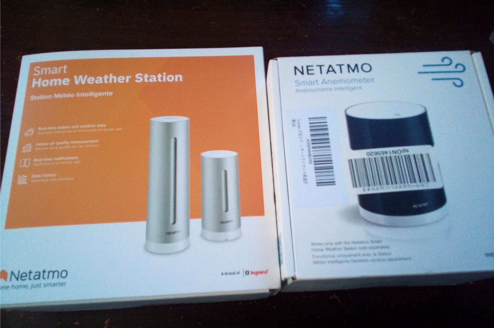
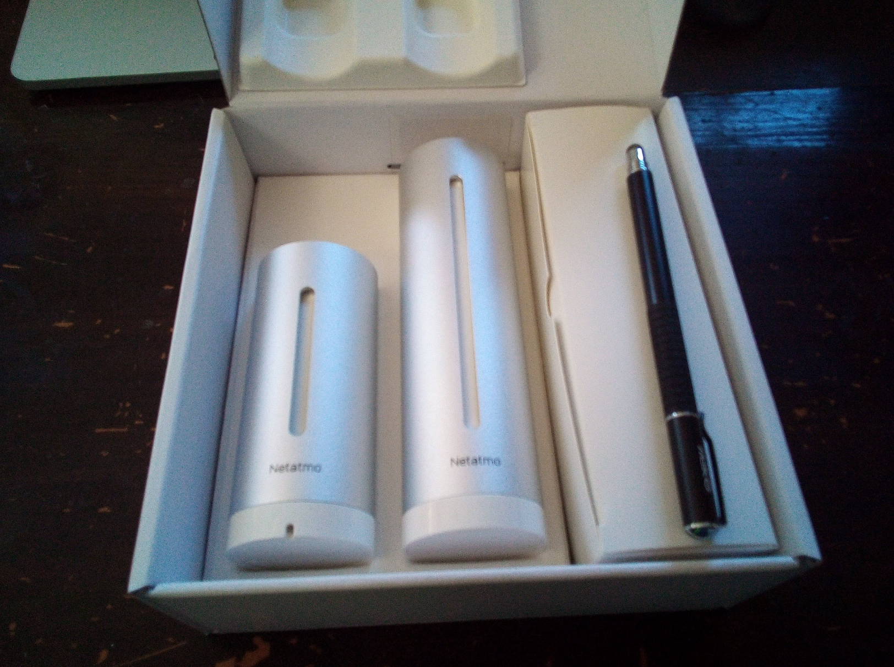
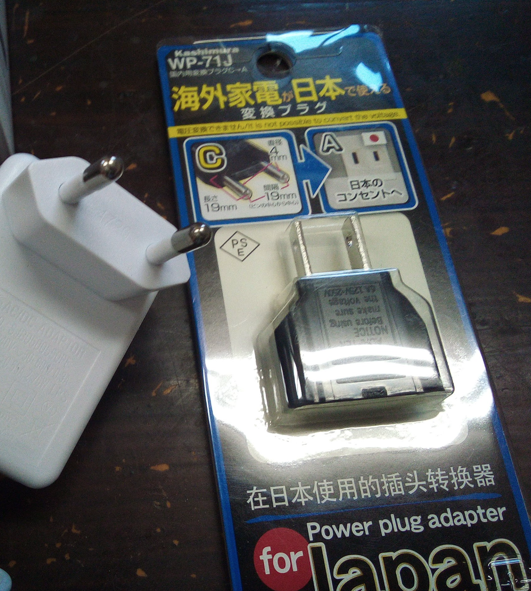
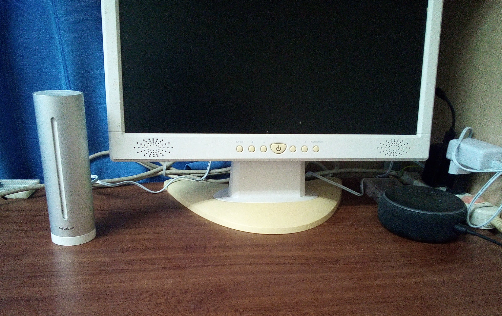

「家に気象観測装置をつけるぞー」
と意気込んであれこれ悩んだ結果、雨量計・風速計モジュールがある「NETATMO」を導入してみることにしました。

購入したのはこちら。  
「NETATMO(ネタトモ) ウェザーステーション」一式をAmazonにてゲットしました。

<iframe style="width:120px;height:240px;" marginwidth="0" marginheight="0" scrolling="no" frameborder="0" src="https://rcm-fe.amazon-adsystem.com/e/cm?ref=qf_sp_asin_til&t=massasquash04-22&m=amazon&o=9&p=8&l=as1&IS1=1&detail=1&asins=B07TXD3QQ5&linkId=08d36594284188d18e93913149c7f597&bc1=FFFFFF&amp;lt1=_top&fc1=333333&lc1=0066C0&bg1=FFFFFF&f=ifr">
    </iframe>

<iframe style="width:120px;height:240px;" marginwidth="0" marginheight="0" scrolling="no" frameborder="0" src="https://rcm-fe.amazon-adsystem.com/e/cm?ref=qf_sp_asin_til&t=massasquash04-22&m=amazon&o=9&p=8&l=as1&IS1=1&detail=1&asins=B0116JY608&linkId=ddd231dc95c3e20efb1509f61e3a0a68&bc1=ffffff&amp;lt1=_top&fc1=333333&lc1=0066c0&bg1=ffffff&f=ifr">
    </iframe>

<iframe style="width:120px;height:240px;" marginwidth="0" marginheight="0" scrolling="no" frameborder="0" src="https://rcm-fe.amazon-adsystem.com/e/cm?ref=qf_sp_asin_til&t=massasquash04-22&m=amazon&o=9&p=8&l=as1&IS1=1&detail=1&asins=B016OHME1A&linkId=a19cad97019fd3e35b038dabeee9ecd0&bc1=ffffff&amp;lt1=_top&fc1=333333&lc1=0066c0&bg1=ffffff&f=ifr">
    </iframe>

屋内モジュール・屋外モジュールのセットがメインの機体で、オプションとして雨量計と風速計がそれぞれ追加モジュールとして販売されています。

左がメインのモジュール、右が風速計。  
この後、雨量計も届きます。

メインモジュールの中身です。  
ペンはサイズ比較のため、適当にiPadで使っているペンを置いてみました。  

屋内モジュールの電源を取るのにタイプC -> 変換プラグが必要でした。 
どこから買うかによって、必要か不要か変わるのかもしれません。  

こんな感じで、まずは屋内モジュールを設置してみました。

